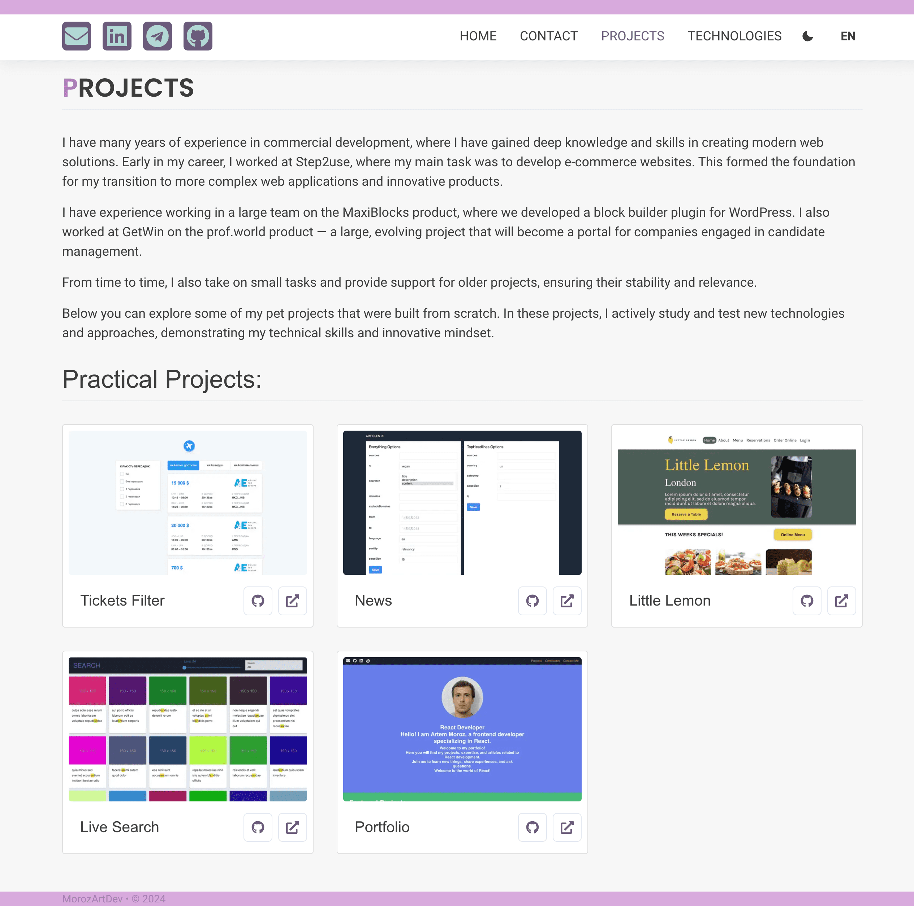
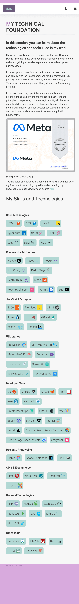
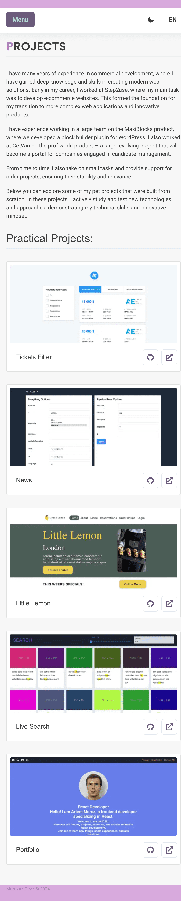

# Frontend Portfolio

This is a personal portfolio project showcasing frontend development skills, technologies, and pet projects. The application is built using modern frontend technologies and includes a variety of features aimed at demonstrating both business logic handling and user interface development.

## Features

- **Pages**: The application contains the following pages:

  - **Welcome**: A homepage introducing the portfolio and developer.
  - **Projects**: A detailed showcase of completed projects.
  - **Technologies**: An overview of the technologies and tools used.
  - **Certificates**: A page listing professional certificates.
  - **Contacts**: A page for reaching out with contact information.

- **Theme Toggle**: The app includes a light/dark mode switcher to allow users to toggle between themes.
- **Language Selection**: Supports multiple languages (English, Ukrainian, Russian) with a language switcher available in the UI.
- **Responsive Design**: Fully responsive layout using Chakra UI.
- **Separation of Concerns**: The application follows best practices by separating business logic and UI components, ensuring scalability and maintainability.

## Project Structure

The project is organized into the following folders:

- **/app**:
  Contains core application files, including locale-based pages and API routes.

- **/assets**:
  Stores static assets like images that are used throughout the application.

- **/components**:
  Contains reusable React components, organized into several categories:

  - **common**: Shared components used throughout the application.
  - **layout**: Components related to page layout and structure.
  - **sections**: Components representing different sections of the website.
  - **ui**: Small UI components like buttons and form elements.

- **/config**:  
  Stores configuration files, such as constants for language settings, menus, and social media.

- **/containers**:  
  Contains container components that manage the business logic of the application. These components handle data fetching, state management, and interaction with APIs, then pass the data down to presentational components.

- **/contexts**:  
  Contains React Context files that manage global states such as theme settings, font preferences, and language selection. These contexts help in providing shared functionality throughout the app.

- **/hooks**:  
  Custom React hooks that encapsulate reusable logic, such as fetching API data, managing themes, and rotating content.

- **/lib**:  
  Utility libraries and modules that provide reusable functions for API calls and other common tasks.

- **/styles**:  
  Contains all the styling-related files, including theme configuration, global styles, and component-specific styles written in SCSS.

- **/types**:  
  TypeScript type definitions for the data structures used throughout the application.

- **/utils**:  
  Utility functions that provide common operations, such as managing local storage, fetching API data, and generating meta tags for SEO purposes.

## Installation

To run the project locally, follow these steps:

1. Clone the repository:

   ```bash
   git clone https://github.com/moroz-art-dev/frontend-portfolio.git
   ```

2. Navigate to the project directory:

   ```bash
   cd frontend-portfolio
   ```

3. Install the dependencies:

   ```bash
   npm install
   ```

4. Start the development server:

   ```bash
   npm run dev
   ```

5. Open your browser and visit [http://localhost:3000](http://localhost:3000) to view the application.

## Technologies Used

- **Next.js**: React framework for server-side rendering and static site generation.
- **React**: JavaScript library for building user interfaces.
- **TypeScript**: Strongly typed programming language that builds on JavaScript.
- **Chakra UI**: A modular and accessible component library.
- **Sass**: CSS preprocessor for styling.
- **Lodash**: Utility library for simplifying common programming tasks.
- **i18next**: Internationalization library for managing translations.
- **Axios**: Promise-based HTTP client for making API requests.
- **React Query**: Library for fetching, caching, and updating server data in React applications.
- **Framer Motion**: Library for animations in React.
- **Stylelint**: Linter for CSS and SCSS to ensure consistent code style.

## Demo

Check out the live version of the project here: [Live Demo](https://github.com/moroz-art-dev/frontend-portfolio)

## Screenshots





## License

This project is licensed under the MIT License.
